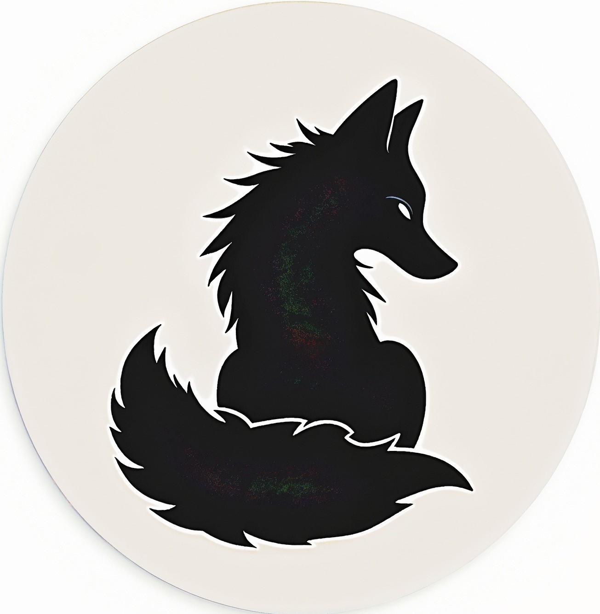

### :blush: Hi, I'm Bruj Wiktor!

---

# Junior Frontend Developer | React | Next.js

I'm currently a front-end developer with knowledge of HTML, CSS, JavaScript, TypeScript, React, and Next.js. I'm currently studying to become a full-stack developer. I also taught myself Python, as well as some basic C and Java skills. I've also worked with Git and on responsive website design. I have a well-developed logical mind.

## :computer: Tech Stack

## :books: Educational projects

- [Coffe Joy](https://github.com/Wiktor-Bruy/webee-project) - A small website for a cafe where you can find information about it, reviews, a photo gallery, and where to find it. Developed using HTML and CSS.
- [Paw hut](https://github.com/Wiktor-Bruy/paw-haven) - A small, one-page website for an animal shelter where anyone can find a friend. HTML, CSS, and JavaScript were used in the development. The list of animals and reviews are generated using API requests. They are also used to submit information about those interested in adopting a pet.

## :fire: Own projects

- [Get a pair 2.0](https://github.com/Wiktor-Bruy/get-a-pair2.0) - Hello everyone! We present to you a new version of the browser game where you need to match pairs of pictures. This is a revised and improved version. Images are rendered based on API requests. Round time and overall game time are also tracked. There are several difficulty levels.
- [Game run](https://github.com/Wiktor-Bruy/game-run) - This is my first game, written in Python. It has no levels. The player must run forward endlessly, destroying enemies. Some can be eliminated by squeezing from above. Others can only be shot. If you lose, you'll be taken to a screen where you can start over.

## :mega: Languages

- English - Elementary
- Ukrainian - Native
- Russian - Fluent

## :mailbox_closed: Contacts

- 
- 
- [:email:](mailto:holmyliszag@ukr.net)
